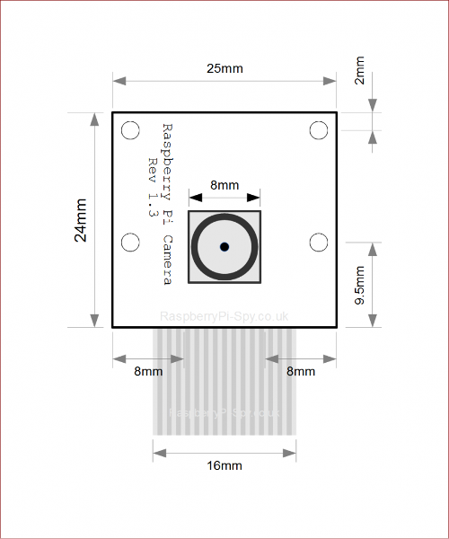

# Measurements of 3D Model

## House

- Length: `280mm`
- Height:
  - `160mm` edge shallow
  - `195mm` center tip
- Thickness:
  - `5mm` on sides
  - `10mm` on screen side
  - `70mm` front to back

## PCB Board

- Length: `204.47mm`
- Width: `135.38mm`
- Offsets
  - `2mm` shifted down from center of box
  - Top of board is `65.69mm` from center of box
  
## LCD Screen

- Full Screen With Bezel
  - Length: `211mm`
  - Width: `126mm`
  - Thickness: `7mm`
- Screen without Bezel
  - Length: `201mm`
  - Width: `115mm`
- Offsets
  - `2mm` shifted down from center of box

## LEDs

- `10.922mm` from edge of board for first and last LED
- `20.32mm` inbetween each LED
- Hole in board
  - Width: `3mm`
  - Height: `2mm`
  - `15mm` from edge of board
  - Holes at +- [`91.44mm`, `71.12mm`, `50.8mm`, `30.48mm`, `10.16mm`]

## Camera

- PCB Square
  - Length: `25mm`
  - Width: `24mm`
- Inner Camera
  - Length: `8mm`
  - Width: `8mm`
- 
 
## Side Ports
 
- Power Jack `23mm` from bottom of PCB board
- Audio Jack `110mm` from bottom of PCB board

## Speakers

- Speakers itself
  - Height: `27mm`
  - Width: `21mm`
- Speaker Printed Box
  - Height `33mm`
  - Width: `27mm`
  - Depth: `15mm`
