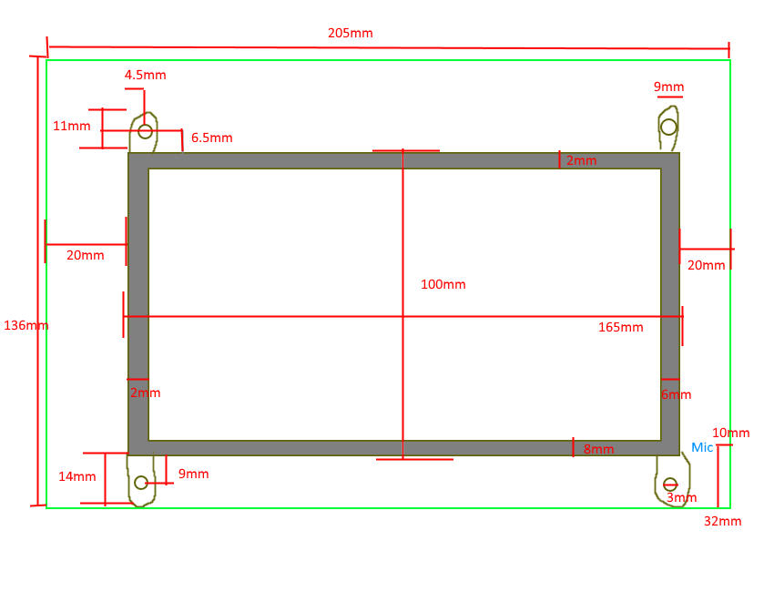

# Measurements of 3D Model

## House

- Length: `280mm`
- Height:
  - `160mm` edge shallow
  - `195mm` center tip
- Thickness:
  - `5mm` on sides
  - `10mm` on screen side
  - `70mm` front to back

## PCB Board

- Length: `205mm`
- Height: `136mm`
- Thinkness: `1.6mm`
- Depth from front: `25mm`
  
## LCD Screen

- PCB of Screen (blue part) (not including holes)
  - Length: `165mm`
  - Height: `107mm`
  - Thinkness: `2mm`
  - Numbs
    - Length: `8mm`
    - Height: `9mm`
    - Hole diameter: `3mm`
      - Offset from PCB: `4mm`
- Full Screen With Bezel
  - Length: `165mm`
  - Height: `100mm`
  - Thickness: `7mm`
  - `5.5mm` offset from bottom Blue PCB
- Screen without Bezel
  - Length: `157mm`
  - Height: `90mm`
- Overall thickness: `9mm`

## LEDs

- Hole in board
  - Width: `board`
  - Height: `8mm`
  - `7mm` from top edge of board
- Each LED
  - Radius: `5mm`
  - Hight: `26mm`
    - Height to botton of bulb: `18mm`

## Camera

- Outer
  - Height: `51mm`
  - Width: `25mm`
- Inner Camera
  - Ring Diameter: `8mm`
  - From top: `10mm`
 
## Side Ports
 
- Power Jack `25mm` from bottom of PCB board
  - Power Jack Width (depth from PCB): `12mm`
  - Power Jack Height: `9mm`
  - Hangs off side of board by: `2mm`
- Audio Jack `63mm` from bottom of PCB board
  - Audio Jack Width (depth from PCB): `6mm`
  - Audio Jack Height: `7mm`  
  - Hangs off side of board by: `2mm`
  
## Speakers

- `25mm` from back of PCB
- Speakers itself
  - Height: `27mm`
  - Width: `21mm`
- Speaker Printed Box
  - Height `33mm`
  - Width: `27mm`
  - Depth: `15mm`

# Servo

- Height: `55mm` (edge to edge)
  - Height of Body: `40mm`    
  - Height from edge to middle of Blade: `37mm`
- Width: `20mm`
- Depth: `27mm`
  - Depth to front of Blade: `45mm`
- Blade Length edge to edge: `39mm`
- Offset from PCB: `25 mm`

# Screw

- hole diameter: `4mm`
- Standoff length: `41.5mm`

# Cable

- When bend HDMI and Touch: `5mm`
- `73mm` from bottom PCB to touch cable

