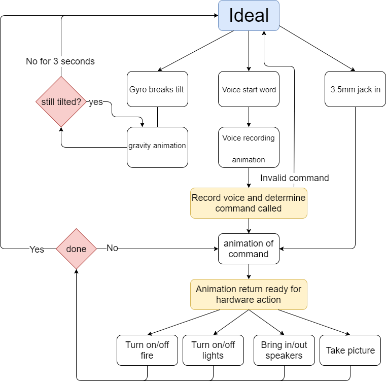

[How to setup board for Seahaven](./docs/setup.md)

# Important Notes

- **HARD** Assumption screen is 800 x 480

# Seahaven mappings

Each event is given a index number to save from having to send a string. A future enum will be created in the host portion.

Each event has two parts `<type> <value>`

## Host-to-Web Calls
- `0`
- `1` - Light switch animation
  - `0` - Turn on
  - `1` - Turn off
  - `2` - Toggle Lights
- `2` - Tell Truman to stop talking
- `3` - Fireplace animation
  - `0` - Turn on
  - `1` - Turn off
  - `2` - Toggle Fire
- `4` - Camera animation
  - `0` - About to take picture
  - `1` - Take picture (flash)
  - `2` - Make GET request for photo and put it up
- `5` - Speakers animation
  - `0` - Bring out speakers
  - `1` - Music playing
  - `2` - Music stopped
  - `3` - Put away speakers
- `6` - Temperature Reading
  - Send temperature as 2 digit int
- `7` - Gyro animation
  - Value is of rotation in degrees between -Pi/2 and Pi/2 where 0 is level
    - **NOTE**: You need the leading zero so `0.707`, NOT `.707`
    - -Pi/2 (-0.707) is tilt right
    -  Pi/2 (0.707) is tilt left
    - Sending 0 is how Web knows everything is back to level
    - Values not matching above are assumed to be the current high score
- `8` - Chatting with Mr T.
  - Send string of what he should say. Also need number for callback in main
  - **NOTES**
    - Only 2 lines max
    - Each line is 16 character max (spaces are less, its not a even value for width)
    - use ` ` to seperate line
      - Example: `How are you on this day`
- `9` - Toggle fidget spinner
- `10` - Super Saiyan Mode

## Web-to-Host Calls
- `0` - Busy with Animation - try again later
- `1` - Light switch animation
  - `0` - Turn on lights
  - `1` - Turn off lights
- `2` - Fireplace (Fan) animation
  - `0` - Turn on fan
  - `1` - Turn off fan
  - `2` - Starting fire on animation
  - `3` - Starting fire off animation
- `3` - Camera animation
  - `0` - Ready to take picture (countdown)
  - `1` - Picture on wall
- `4` - Speaker animation
  - `0` - Speakers Up and ready
  - `1` - Speakers Down
- `5` - Gyro tilt info
  - `0` - animation back to ideal mode
  - `1` - truman hit wall
  - `2` - couch hit wall
- `6` When speaking animation is ready, what to send
  - `0` - misunderstand.wav
  - `1` - chat.wav
  - `2` - not_hot.wav
  - `3` - quick_math.wav
  - `4` - skraa.wav
- `7`
- `8` - Value of audio
  - Range is 1 - 100
- `9` - System reboot/turnoff
  - `0` - Halt
  - `1` - Reboot
-`10` - Update game highscore
  - The high score is attached value
  
## State Machine

